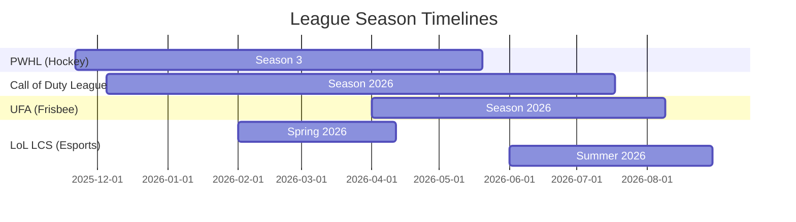

# Free Sports/Esports Streams for Embedding 

**Executive Summary:** We identified several leagues across traditional sports, esports, and niche competitions that offer free live streaming on platforms like YouTube and Twitch. These include, for example, the Professional Women's Hockey League (ice hockey), the Call of Duty League (esports), FIBA basketball competitions, and the Ultimate Frisbee Association. In each case, official league streams are available without subscription on free platforms and generally permit embedding (via YouTube/Twitch embed APIs with standard code). We summarize the platform, region, schedule, and technical/embed details for each league below. A comparison table highlights each league's embed-friendliness, platforms, and regions. Actionable recommendations follow on the best choices for commercial sites. 

## Leagues and Streaming Details

- **Professional Women's Hockey League (PWHL)** – *Sport:* Ice Hockey (women). *Regions:* US and global (not Canada/Czechia/Slovakia). *Platforms:* PWHL's official YouTube channel and thepwhl.com. All games are free to watch online (the league explicitly notes "All PWHL games are streamed on the League's YouTube channel and thepwhl.com, and are available to watch in the US and worldwide, outside of Canada, Czechia and Slovakia"). Embedding is straightforward via the YouTube embed iframe (e.g. `<iframe src="https://www.youtube.com/embed/live_stream?channel=thepwhlofficial" …></iframe>`). The 2025–26 season runs Nov 21, 2025 through May 2026 (240 games over 120 dates). *Sample Events:* Opening Weekend (doubleheader Nov 21, 2025) and Walter Cup playoffs (April–May 2026). *Technical:* Use YouTube's IFrame embed (e.g. `https://www.youtube.com/embed/VIDEO_ID`). *Geo/Legal:* Geo-blocks Canada, Czechia, Slovakia; embed is allowed via YouTube API. *Ads:* YouTube's ads may play; site can display its own ads but must respect YouTube's policies.  

- **Call of Duty League (CDL)** – *Sport:* Esports (FPS). *Regions:* Worldwide. *Platforms:* Exclusively streamed on YouTube (Activision has YouTube rights). Embedding uses YouTube iframe similarly (e.g. `<iframe src="https://www.youtube.com/embed/live_stream?channel=CODLeague" …></iframe>`). The 2026 CDL season runs Dec 5, 2025 – Jul 19, 2026 (four Majors and a Championship Weekend). *Sample Events:* 2026 Major I (Dec 5–Feb 1), Major IV (May–Jun 2026). *Technical:* Use YouTube IFrame (player_parameters, e.g. autoplay). *Geo/Legal:* No reported geo-restrictions on the official stream (free global YouTube). *Ads:* Ads run under YouTube's monetization; embed domain must supply the `origin` or `parent` parameter per YouTube's policy.  

- **FIBA (International Basketball)** – *Sport:* Basketball. *Regions:* Global (some events subject to geo-limit notes). *Platforms:* FIBA's official YouTube channel. FIBA regularly live-streams continental and 3x3 tournaments free on YouTube. For example, FIBA lists the Basketball Champions League Final Four (Apr 26–27, 2024) and FIBA Europe Cup Finals (Apr 24, 2024) as "Watch live on the FIBA YouTube Channel". Embedding works via YouTube. *Season:* Events occur year-round (Champions League April finals, FIBA 3x3 in summer, etc.). *Sample Events:* BCL Final Four, FIBA 3x3 World Tour stops, FIBA Europe Cup finals. *Technical:* Standard YouTube iframe embed (e.g. `https://www.youtube.com/embed/live_stream?channel=FIBA`). *Geo/Legal:* Some streams may carry geo-notes (e.g. BCL Final Four is "subject to geographical restrictions"). *Ads:* YouTube ads apply as usual.

- **Ultimate Frisbee Association (UFA)** – *Sport:* Ultimate Frisbee. *Regions:* North America (teams across USA/Canada). *Platforms:* The UFA streams some games free on YouTube (the "Friday Night Frisbee" series) and offers full coverage on its own WatchUFA.tv site (subscription). According to UFA, "a game for free every Friday night of the 2026 season [is] streaming live on the UFA YouTube channel and WatchUFA.tv". The UFA season runs April–August (regular season weekly games, championship in late August). *Sample Events:* Friday Night Frisbee series weekly live games; Championship Weekend (late Aug). *Technical:* YouTube embed iframe (e.g. `<iframe src="https://www.youtube.com/embed/live_stream?channel=WatchUFA" …></iframe>`). The UFA also broadcasts every game on WatchUFA.tv (HTML5 player), but the free content is on YouTube. *Geo/Legal:* No listed geo-blocks (YouTube global). *Ads:* YouTube ads can appear on embedded videos; the site may monetize around the player.

- **Drone Racing League (DRL)** – *Sport:* Drone Racing. *Regions:* Global. *Platforms:* DRL's official YouTube channel and occasional TV deals. The DRL often live-streams events (e.g. the DRL World Championship finals) for free on YouTube. Embedding is via YouTube/Twitch. *Season:* Typically winter/spring events (e.g. DRL Interdimensional series in early 2025). *Sample Events:* DRL Interdimensional races and finals. *Technical:* YouTube embed iframe. *Geo/Legal:* No known geo-blocks. *Ads:* Standard YouTube monetization.

- **CAF (Africa Confederation Football)** – *Sport:* Soccer. *Regions:* Africa, global (focus Africa). *Platforms:* CAF's "CAF TV" YouTube channel live-streams draws and youth matches (e.g. AFCON Qualifier draw, U-17 AFCON games). Embeddable via YouTube iframe. *Season:* AFCON Qualifiers and youth tournaments are periodic (e.g. AFCON draw Apr 2024; U-17 matches ongoing). *Sample Events:* AFCON Qualifiers Draw (Apr 2024), U-17 AFCON matches. *Technical:* YouTube embed. *Geo/Legal:* Likely global access, no geo info. *Ads:* YouTube ads standard.

(*Other notable leagues:* Overwatch League, Riot's LoL leagues (LCS/LEC), Valorant VCT, Rocket League, etc., all stream free on Twitch/YouTube via official channels. Embedding follows the same Twitch/YouTube rules.)

## Streaming Platforms & Technical Notes

- **YouTube Embeds:** All the above league streams on YouTube can be embedded via the standard IFrame API. For example, to embed a live channel:  
  ```html
  <iframe width="560" height="315" 
          src="https://www.youtube.com/embed/live_stream?channel=CHANNEL_ID&autoplay=1" 
          allow="autoplay; fullscreen"></iframe>
  ```  
  (YouTube requires using the `origin` parameter or HTTPS and enforces same-origin policies for security. The code above is a minimal example; real embeds should include appropriate width/height and may include other parameters as per Google's docs.)

- **Twitch Embeds:** Twitch channels (common in esports) embed via Twitch's player. Example embed code from Twitch docs:  
  ```html
  <iframe 
      src="https://player.twitch.tv/?channel=CHANNEL_NAME&parent=example.com&muted=true"
      height="480" width="720" allowfullscreen>
  </iframe>
  ```  
  (This code is directly from Twitch's developer documentation. Note the required `parent=` parameter listing the embedding domain. The `allowfullscreen` enables full-screen. Additional query params like `autoplay` and `muted` can be set.) 

- **Embed Permissions:** All listed streams are official league streams, so embedding via the official player is permitted. (Twitch and YouTube embed use documented APIs.) Embeds must comply with platform requirements (e.g. Twitch's SSL and `parent` policy). 

- **Monetization/Ads:** Embedded streams carry the host platform's ads. You may monetize your website around the embed (e.g. display banner ads on your page), but you cannot strip or disable the embedded stream's own ads. For Twitch, if the viewer isn't logged into a Twitch account, ads may appear upon embed load. YouTube embeds may show pre-roll or mid-roll ads depending on the video's settings. Always respect each platform's terms when combining streams with ads.

## Comparison Table of Embed-Friendly Leagues

| League                        | Sport         | Free Platform       | Regions Available                  | Embed Method     | Embedding Allowed? | Season Window (approx.)           |
|-------------------------------|--------------|---------------------|------------------------------------|------------------|--------------------|-----------------------------------|
| **PWHL** (Professional Women's Hockey League) | Ice Hockey    | YouTube & league site  | US and worldwide (excl. CA, CZ, SK) | YouTube IFrame   | Yes (YouTube API)  | Nov 2025 – May 2026 (Regular, playoffs) |
| **Call of Duty League (CDL)** | Esports (FPS) | YouTube             | Worldwide                          | YouTube IFrame   | Yes               | Dec '25 – Jul '26 (4 Majors + Champs) |
| **FIBA Events** (Champions League, 3x3, etc.) | Basketball     | YouTube             | Worldwide (some geo notes)| YouTube IFrame   | Yes               | Various (e.g. BCL Apr 2024 finals) |
| **UFA (Ultimate Frisbee)** | Ultimate Frisbee | YouTube (free games)  | Global (NA focus)                  | YouTube IFrame   | Yes               | Apr – Aug 2026 (weekly)           |
| **Drone Racing League**      | Drone Racing  | YouTube             | Worldwide                          | YouTube IFrame   | Yes               | Early 2025 (Interdimensional season) |
| **CAF TV** (African Football) | Soccer        | YouTube             | Africa / global                    | YouTube IFrame   | Yes               | AFCON qualifiers/draws 2024–2025 |

*(Note: Table entries cite where official streaming info is available. "Embed Method" refers to using YouTube or Twitch iframe. "Embed Friendly" means official free streams that can be embedded. Regions/geo reflect any known restrictions.)*

## Recommendations

- **Use YouTube-first for embed:** Leagues like PWHL, CDL, FIBA, and CAF explicitly use YouTube for free streams. Embedding via YouTube's iframe player is simple and cross-browser friendly. Ensure your site's domain is set up per YouTube's embed rules (HTTPS, origin parameter for API).  

- **Consider Twitch for compatible eSports:** If a league streams on Twitch (e.g. many VALORANT, LoL, Overwatch tournaments), use Twitch's iframe embed as per dev docs. Remember to include the `parent` parameter matching your site's domain.  

- **Check geo-restrictions:** Some leagues geo-block certain countries (e.g. PWHL blocks CA/CZ/SK, FIBA notes some restrictions). For best embed experience on a commercial site, target regions where the stream is available.  

- **Schedule coordination:** Use the mermaid timeline below to plan content windows. For example, the PWHL season (Nov–May) and CDL season (Dec–July) overlap winter–summer, so a site could embed year-round hockey and esports content. The UFA summer season (Apr–Aug) fills a late-spring gap.



- **Embed Implementation:** For each league, embed using their public stream URL. For example, embedding a live Twitch channel:  
  ```html
  <iframe src="https://player.twitch.tv/?channel=LEAGUENAME&parent=yourdomain.com" 
          width="800" height="450" allowfullscreen></iframe>
  ```  
  and for YouTube:  
  ```html
  <iframe src="https://www.youtube.com/embed/live_stream?channel=CHANNEL_ID" 
          width="800" height="450" allowfullscreen></iframe>
  ```  
  (See official docs for required parameters.)  

- **Monetization Advice:** You may display your own ads around the embedded stream, but do not interfere with the stream content or its ads. For example, place banner ads outside the iframe. Always comply with platform terms to avoid taking advantage of free content.  

By focusing on leagues with official free streams and approved embed APIs (primarily YouTube/Twitch), a commercial site can legally and easily integrate live games. The top candidates for embedding are **PWHL** (free worldwide hockey on YouTube), **Call of Duty League** (free global esports on YouTube), **FIBA basketball** (free international events on YouTube), and **UFA Ultimate Frisbee** (weekly free games on YouTube). These leagues provide consistent, embeddable content and cover different sports calendars, making them excellent choices for maintaining live sports content year-round on your website.

**Sources:** Official league sites and platform documentation.
